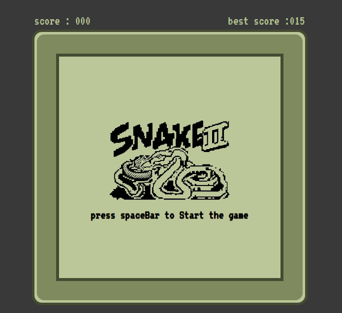
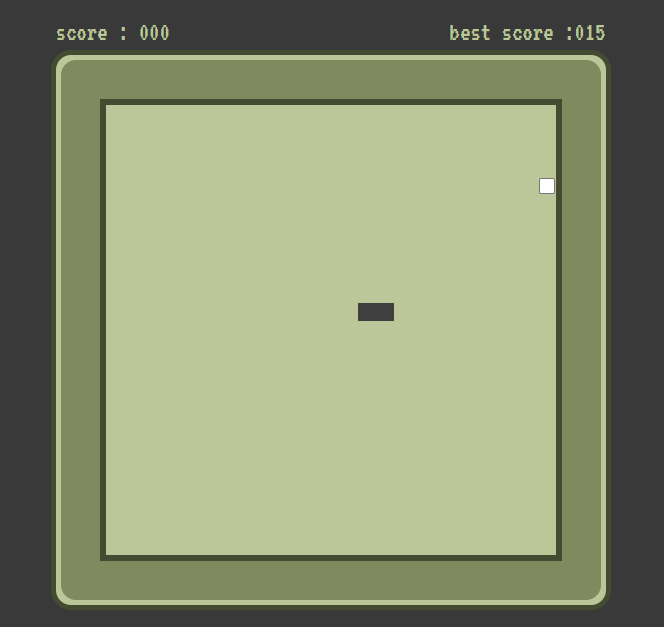

# 🐍 SNAKE GAME

A classic Snake game built with JavaScript, HTML, and CSS.

---

## 🎮 Preview

- Before game start:

  

- Game in progress:

  

---

## 📦 Features

- Dynamic snake movement with arrow keys
- Random food generation
- Score tracking and best score via localStorage
- Audio effects for eating and game over
- Snake wraps around edges (infinite grid!)
- Responsive grid-based layout

---

## 🕹 How to Play

- Press the **Space bar** to start
- Use **Arrow keys** to control the snake:
  - ⬆️ Up
  - ⬇️ Down
  - ⬅️ Left
  - ➡️ Right
- Eat the white food to grow and score points
- Avoid crashing into yourself!
- Game speeds up after each food

---

## 📁 Files

- `index.html` – Main game layout
- `script.js` – Game logic
- `style.css` – Styling
- `eat.mp3` – Sound effect for eating
- `gameover.mp3` – Game over sound
- `README.md` – You're reading it!

---

## 👨‍💻 Author

- **Yassine Azarguy**  
  [GitHub Profile](https://github.com/azargui)

---

🎮 Have fun playing!
